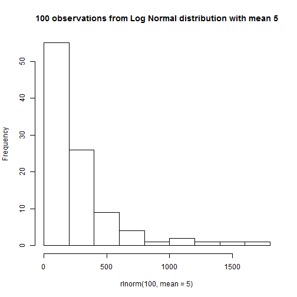

## Why this App?

1. To explain probability distributions to beginners
2. In a dynamic way (not with static bookish charts)
3. Marry Math and Technology

--- .class #id 

## What the App does?

* Allows users to:
1. Change number of sample observations to draw
2. Change type of probability distribution to draw from
3. Change mean from the standard (zero mean)

---
## How the App does it? [1/2]

1. Uses inbuilt statistical libraries in R
2. Uses plot function together with user's inputs
* e.g. for plotting Log Normal distribution of 100 observations with mean = 5, it runs the code (of course using the inputs in forms of user inputs instead of the hard code shown on next slide):


---
## How the App does it? [2/2]


```r
hist(rlnorm(100, mean = 5), main = paste("100 observations from Log Normal distribution with mean 5"))
```

 


